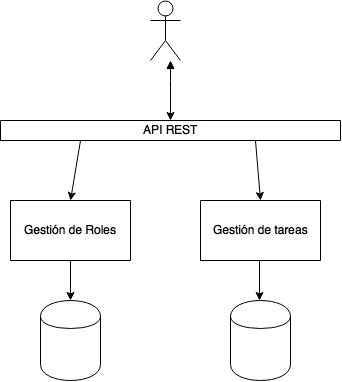

# ContentTaskMS

Proyecto de prácticas para la asignatura Cloud Computing de primer curso del master profesional en ingeniería informática de la UGR.

## Problema y solución propuesta

### Problema

Controlar un sistema CMS como por ejemplo Wordpress donde colaboran muchas personas, como por ejemplo en un magazine online, puede ser una ardua labor a la hora de la planificación y gestión de tareas como por ejemplo calendarios de publicación, eventos relevantes, o las fechas de entrega para diseños gráficos necesarios como por ejemplo para una campaña de publicidad en dicho magazine.

### Solución

Se desarrollará un software capaz de gestionar todas las tareas o al menos las críticas de un magazine online o un sistema de gestión de contenidos donde colaboren muchos usuarios y sea necesaria una organización y control de los hitos y tareas realizadas.

## Tecnologías del proyecto

### Arquitectura
Dado el carácter cloud y la necesidad de un buen escalado de cara al aumento del número de usuarios, se utilizará una arquitectura basada en microservicios.

### Microservicios
Los microservicios a implementar en la primera versión de la aplicación serán los críticos para un equipo de personas que trabajen colaborativamente en un CMS. Por un lado se implementaran un microservicio encargado de la gestión de roles dentro del equipo, a su vez se implementará otro microservicio encargado de la gestión de las tareas e información asociada a estas que pueden tener asignadas las diferentes personas involucradas.



### Back-end

El back end irá implementado sobre node.js, con el microframework Express y bases de datos MongoDB.

### Front-end

En el Front-end usaremos el framework AngularJS, CSS3 con Bootstrap y HTML5.

### Licencia

Licencia [GNU GPL v3](https://github.com/joseangeldiazg/MII-CloudComputing/blob/master/LICENSE).


## Provisionamiento

Para el provisionamiento de la aplicacion puede optarse por dos sistemas de aprovisionamiento, Ansible y Chef. Antes de comenzar con el provisinamiento, debemos tener en cuenta las siguintes consideraciones:

1. La máquina virtual usada es Ubuntu 14.04 ofrecida por AWS.
2. El sistema operativo nativo usado es Mac OS x por lo que algunos comandos pueden cambiar.

Para poder provisionar nuestra instacia el primer paso es tener una instancia levantada en algun servicio cloud y configurar las claves de acceso para evitar tener que estar introduciendo continuamente estas. Una vez que la máquina virtual nos responda podremos comenzar con el provisionamiento.

Para aprovisionar usando Ansible, tenemos los pasos detallados [aquí](https://github.com/joseangeldiazg/MII-CloudComputing/tree/master/aprovisionamiento/Ansible).

Si por el contrario preferimos usar Chef, podemos encontrar la receta y los pasos para ejecutarla [aquí](https://github.com/joseangeldiazg/MII-CloudComputing/tree/master/aprovisionamiento/Chef).

### Explicación de la selección de los sistemas de provisionamiento

Se han usado estos sistemas de provisionamiento inicalmente por su facilidad de uso ya que son mucho más sencillo e intuitivos que otras opciones estudiadas como Puppet o Salt. Esta sencillez destaca notablemente en Ansible donde no hay que desplegar ninguna estructura de directorios precisa para que este funcione, a diferencia de Chef donde si hay que realizarla lo que hace que sea un poco más complejo que Ansible, dentro de la simplicidad.

Es este el motivo, por el que si hubiera que elegir de entre los dos sistemas usados uno solo, nos quedariamos con Ansible dada su potencia y facilidad de uso con tan solo realizar un playbook.


### Corrección de los compañeros

Se ha corregido el provisionamiento realizado con Ansible del usuario [@fblupi](https://github.com/fblupi) Puede verse la correción en el comentario de [este enlace.](https://github.com/fblupi/GEventator/issues/13#issuecomment-262804439). Tambien se ha probado el provisionamiento de este mismo usuario realizado con chef, la corrección puede verse en el siguiente comentario en [su issue.](https://github.com/fblupi/GEventator/issues/14#issuecomment-262807593)

## Orquestación

### Premisas iniciales.

Antes de comenzar con la documentación de esta parte de la practica en la que explicaremos como orquestar las máquinas virtuales necesarias para acoger nuestros micro servicios es necesario realizar una serie de pequeñas premisas sobre el sistema usado, dado que las ordenes usadas pueden estar sujetas a modificaciones según el sistema que usemos. 

1. Sistema operativo Mac OS X Sierra.
2. Versión de Vagrant: 1.9.1

Para la realización de esta práctica es necesario tener por tanto Vagrant instalado en el sistema operativo de nuestro _workstation_. Así como una cuenta en AWS, donde llevaremos a cabo la orquestación de las máquinas virtuales y su provisionamiento.

### Pasos para la orquestación 

El primer paso es instalar el plugin de Vagrant para AWS. Para ello usaremos el siguiente comando:

	vagrant plugin install vagrant-aws

Tras este momento debemos añadir a Vagrant un box sencillo creado especialmente para la orquestación de máquinas virtuales en este sistema, este box ha sido elegido ya que es el que se usa en todos los tutoriales del plugin de aws además es sencillo y nos permite añadir con facilidad todos los paquetes necesarios por nuestra aplicación sin problema alguno. Para ello usamos el siguiente comando:

	vagrant box add dummy https://github.com/mitchellh/vagrant-aws/raw/master/dummy.box

Tras esto debemos acceder a nuestro panel de Amazon y crear un nuevo usuario que añadiremos a un nuevo grupo de seguridad, al cual daremos permisos de administrador y abriremos los puertos necesarios para permitir conexiones HTTPS, HTTP y SSH. Una vez hecho esto deberemos obtener los siguientes datos:

- AWS access key
- AWS secret key
- SSH keypair name
- SSH private key file (.pem extension)


Tras esto, para evitar problemas de seguridad en el fichero ``.profiles`` de nuestro sistema incluiremos las citadas variables como variables de entorno como sigue, así además de evitar que estas claves sean visibles las tendremos disponibles entre inicio e inicio de sesión.

```
export AWS_KEY='your-key'
export AWS_SECRET='your-secret'
export AWS_KEYNAME='your-keyname'
export AWS_KEYPATH='your-keypath'
```

Tras este punto debemos ejecutar el comando ``vagrant init`` para obtener nuestro modelo de fichero Vagrant para poder introducir los comandos necesarios para la orquestación.

En este documento deberemos cambiar el nombre del grupo de seguridad por el que se vaya a usar y debemos llevar cuidado de que la region donde creamos el grupo de seguridad y donde crearemos las máquinas sean la misma sino no funcionará.


En cuanto al aprovisionamiento, para poder ejecutar sin problema, deberemos cambiar en el fichero ``ansible.cfg`` la palabra RUTA por la ruta al fichero .pem que estemos usando. 


Dado que queremos trabajar con microservicios levantaremos 3 máquinas virtuales. Una encargada de los roles dentro del sistema, otra encargada de las tareas y otra para gestionar la persistencia. El provisionamiento lo llevaremos a cabo con Ansible, teniendo por tanto que alojar el Playbook necesario dentro del mismo directorio de orquestación para evitar problemas.

El contenido del fichero Vagrantfile es [el siguiente](https://github.com/joseangeldiazg/MII-CloudComputing/blob/master/orquestacion/Vagrantfile).

Para ejecutar la orquestación tan solo deberemos ejecutar el comando ``vagrant up`` que creará nuestras máquinas virtuales y las provisionará para poder alojar nuestra aplicación.

Una vez finalizado, podremos acceder a nuestras máquinas virtuales facilmente con el comando ``vagrant ssh nombre``donde ``nombre``en nuestro caso puede tener tres valores, _tareas, roles o almacenamiento_.

### Corrección de compañeros:

Se ha corregido el sistema de orquestación del usuario [AythaE](https://github.com/AythaE). El issue asociado es [este](https://github.com/AythaE/DeFesti/commit/d9d62f9a0b9c5770ca713fcc3878103ed30b674f#commitcomment-20169134).


## Contenedores

Se han usado contenedores Docker siguiendo las [siguientes instrucciones](https://github.com/joseangeldiazg/MII-CloudComputing/blob/master/contenedores/README.md) y un repositorio en Dockerhub enlazado al repositorio central del proyecto. El Dockerfile utilizado podemos encontrarlo [aquí](https://github.com/joseangeldiazg/MII-CloudComputing/blob/master/Dockerfile).

### Correcion de compañeros:

Se ha corregido el sistema de contenedores del usuario [mmaguero](https://github.com/mmaguero). El issue asociado a la correción es [este](https://github.com/mmaguero/MII-CC16-17/issues/7#issuecomment-271393603).
