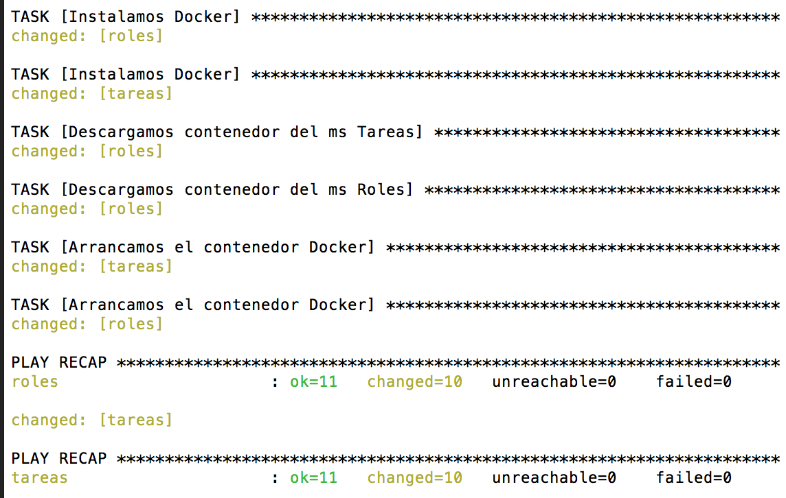

# Infraestructura de Microservicios completa

En este directorio encontramos todo lo necesario para provisionar una arquitectura de microservicios basada en contenedores Docker y máquinas virtuales de Amazon Web Services. La orquestacion y provisionamiento se haran con Vagrant y Ansible y tambien de explicará el uso de ciertos SaaS para deslocalizar ciertas tareas críticas de la aplicación. 

![Imagen 1][1] ![Imagen 2][2] ![Imagen 3][3]  ![Imagen 4][4]  ![Imagen 5][5] ![Imagen 6][6] 

 [1]: ../images/logovagrant.png
 [2]: ../images/logomean.png 
 [3]: ../images/logoaws.png
 [4]: ../images/logodocker.png
 [5]: ../images/logomlab.png
 [6]: ../images/logoansible.png

# Configuración

## Contenedores

Para alojar nuestros servicios crearemos los contenedores en DockerHub. Para ello, debemos crear repositorios automáticos enlazados a git hub tras lo cual indicaremos manualmente la direccción de los dockerfile ya que estos no estan en la raiz del repositorio. 

Los Dockerfile creados, dado que la aplicación se basará en la pila MEAN usan una imagen de Docker con nodeJS y Alpine haciendo así que los contenedores para nuestros microservicios sean ligeros. 

- [Dockerfile para ms Tareas](https://github.com/joseangeldiazg/MII-CloudComputing/blob/master/microservices-iv/dockerfileTareas)
- [Dockerfile para ms Roles](https://github.com/joseangeldiazg/MII-CloudComputing/blob/master/microservices-iv/dockerfileRoles)

## Orquestación de máquinas 

Usaremos Vagrant para crear en AWS las máquinas virtuales que usaremos para desplegar nuestros microservicios. Estas máquinas virtuales deberan tener Docker instalado para poder trabajar bien con los contenedores que orquestaremos en los próximos pasos. 

Las instrucciones detalladas de como orquestar las máquinas podemos encontrarlas en el [siguiente fichero](https://github.com/joseangeldiazg/MII-CloudComputing/tree/master/orquestacion). 

El fichero relativo a la orquestación de las máquinas virtuales es el siguiente [Vagrantfile](https://github.com/joseangeldiazg/MII-CloudComputing/blob/master/microservices-iv/Vagrantfile). Notar como en provisionamiento hacemos referencia a los ficheros Playbook de Ansible que veremos en el punto siguiente, es decir, debemos crear estos para que nuestra orquestación funcione correctamente. 

Debemos dejar claro también que para que la orquestación tenga lugar, debemos haber Exportado las variables de entorno relativas a la conexión con AWS. 

## Provisión de máquinas 

En este caso la provisión de las máquinas cambiará a lo visto anteriormente ya que tenemos contenedores correctamente provisionados lo que haremos con nuestros PlayBooks de Ansible será instalar Docker en las máquinas virtuales, obtener de DockerHub nuestros contenedores y tras esto ponerlos en producción en las máquinas. 

Podemos encontrar un pequeño tutorial sobre como utilizar Ansible en [este enlace](https://github.com/joseangeldiazg/MII-CloudComputing/tree/master/aprovisionamiento/Ansible). 

Dado que orquestaremos dos microservicios, usaremos dos PlayBooks de Ansible. 

- [Playbook para Tareas](https://github.com/joseangeldiazg/MII-CloudComputing/blob/master/microservices-iv/tareas.yml)
- [Playbook para Roles](https://github.com/joseangeldiazg/MII-CloudComputing/blob/master/microservices-iv/roles.yml)

## SaaS

Hay algunas tareas necesarias en la aplicación y las cuales podremos externalizar conseguir que la arquitectura sea aún menos monolítica. Inicalmente nos hemos decantado por separar la base de datos y el servicio de logs. 

### Base de datos

Usaremos el SasS [mLab](www.mlab.com) para extraer el servicio de la base de datos de nuestra aplicación. Para ello necesitamos crear cuenta en dicho portal y de manera gratuita obtenemos una base de datos MongoDB (v3.2.11) a la que podremos conectar fácilmente y la cual está separada de nuestro despliegue final. Una vez creada la base de datos el resultado podemos verlo en la siguiente captura de pantalla. Para conectar con nuestra base de datos solo tendriamos que añadir los credenciales en el código de la app. 

### Log

Para los servicios de log dado que hemos estudiado opciones como logz.io o Loggly, nos decantaremos por Amazon CloudWatch que nos ofrece una interfaz sencilla y está integrado con nuestro sistema. Ofrece funcionalidades gratuitas y en nuestro caso en el que de momento no habra mucha actividad es la mejor opción. Para usarlo solo tenemos que crear un nuevo grupo de logs y seguir los [pasos que indican](https://docs.aws.amazon.com/AmazonCloudWatch/latest/logs/QuickStartEC2Instance.html) para instalar el agente de logs en nuestra app. 

En nuestro caso ya tenemos preparados los grupos de seguridad y usuarios por lo que solo tendremos que crear el agente y el Dashboard de Logs. 

El resulado de haberlo creado podemos verlo en la siguiente capura, aunque como no hay nada aún desplegado este no tiene contenido. 

### Monitorización

Las estadísticas del funcionamiento de las máquinas virtuales también son accesibles desde Amazon CloudWatch. Son un factor importante a tener en cuenta, por lo tanto deberemos crear un panel de estadísticas, añadimos las máquinas de nuestros microservicios y las métricas que nos interesan tras lo cual veremos el siguiente resultado.

# Ejecución 

Para poner en producción todo lo anterior y tener por tanto nuestra infraestructura lista para recibir nuestra app. Solo tenemos que usar el siguiente comando:

	vagrant up --provider=aws 

Tras esto podemos ver como se crean nuestras instancias en AWS y además se descargan y ejecutan los contenedores Docker en ellas. El resultado podemos verlo en las siguientes capturas de pantalla. 

